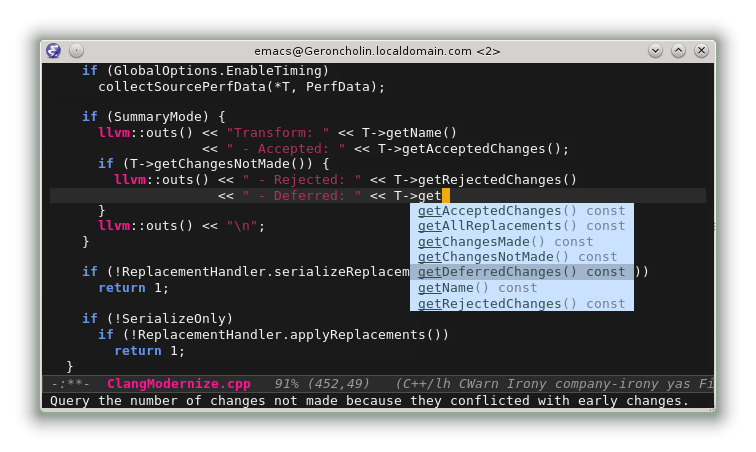

# Completion backend for [irony-mode][irony-mode-ref]

This package provides a [company-mode][company-ref] asynchronous completion
backend for the C, C++ and Objective-C languages.

## Installation

The recommended way to install `company-irony` and its dependencies is through a
package manager:

* Using [MELPA](http://melpa.milkbox.net/)

        M-x package-install RET company-irony RET

* Using [el-get](https://github.com/dimitri/el-get)

        M-x el-get-install RET company-irony RET

## Configuration

Add `company-irony` to your company backends.

~~~el
(eval-after-load 'company
  '(add-to-list 'company-backends 'company-irony))
~~~

[company-ref]:    https://github.com/company-mode/company-mode "Company-Mode"
[irony-mode-ref]: https://github.com/Sarcasm/irony-mode        "Irony Mode"
[yasnippet-ref]:  https://github.com/capitaomorte/yasnippet    "YASnippet"
